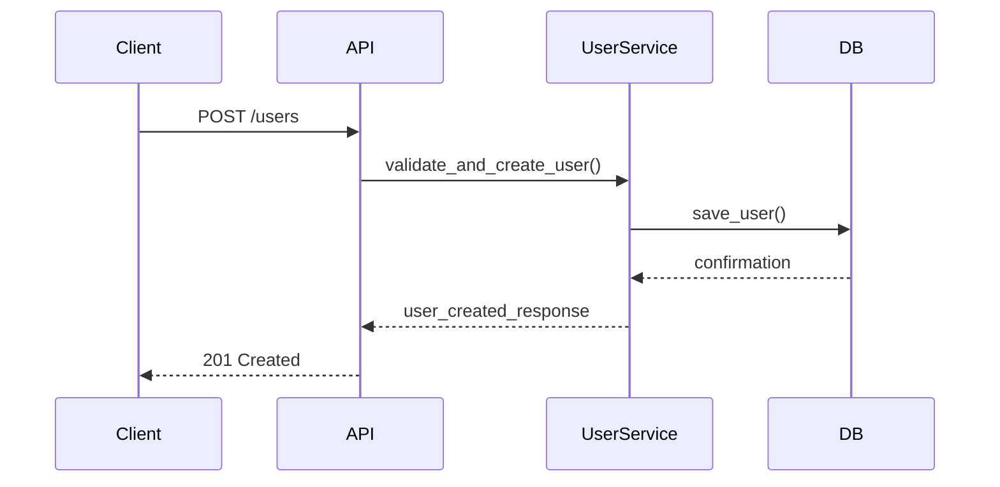
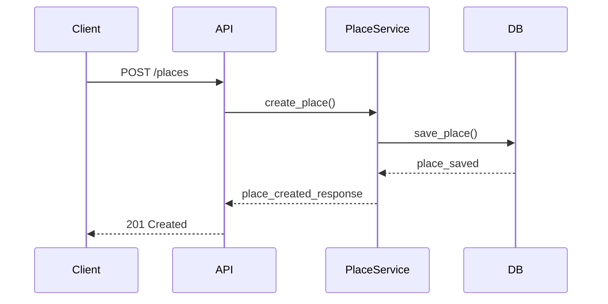
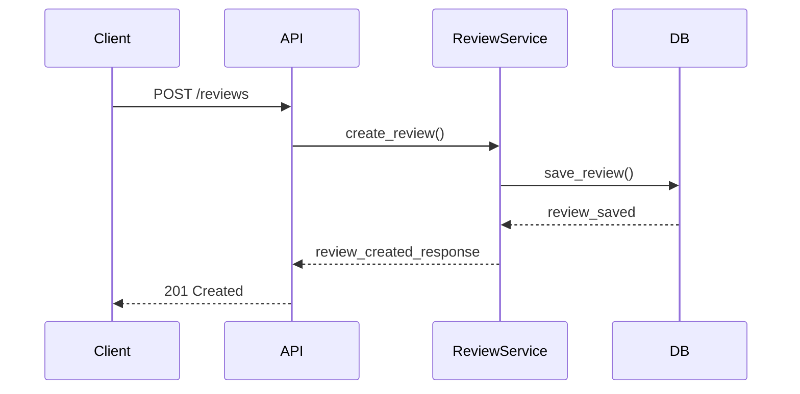
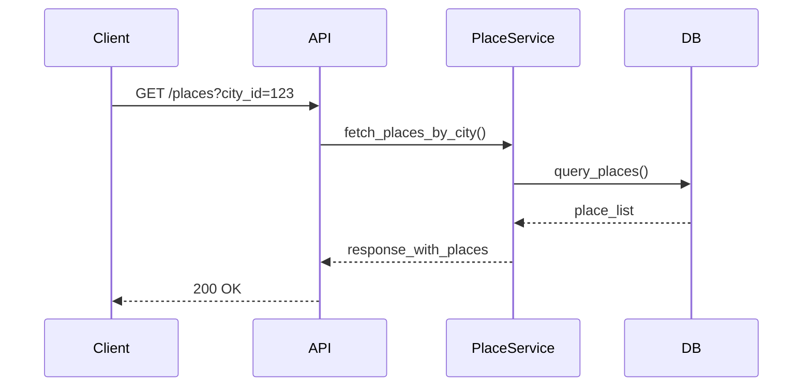

# HBnB: Part 1 - Technical Architecture Overview

## 📄 Introduction

This document provides a comprehensive overview of the system architecture for the HBnB application. It includes a high-level package diagram, a detailed class diagram for the Business Logic layer, and sequence diagrams for major API calls. The goal is to serve as a blueprint for development and to ensure clear understanding of the design and interactions between system components.

## 🧱 High-Level Architecture

### Diagram: High-Level Package Diagram

(See: `/diagrams/high_level_package_diagram.png`)

### Layered Architecture:

The HBnB system is organized into a **three-layer architecture**:

#### 1. Presentation Layer (Services / API Endpoints):

* Handles user interactions.
* Contains RESTful endpoints and services that users interact with.

#### 2. Business Logic Layer (Models):

* Core logic of the system.
* Handles application rules and use cases.
* Includes models such as `User`, `Place`, `Review`, and `Amenity`.

#### 3. Persistence Layer:

* Manages data storage and retrieval.
* Supports both `DatabaseStorage` and `FileStorage`.

### Facade Pattern:

The Presentation Layer communicates with the Business Logic Layer through a **facade interface**, which simplifies interaction by exposing only necessary functionality and shielding the underlying complexity.

---

## 🔎 Business Logic Layer: Class Diagram

### Diagram: Detailed Class Diagram

(See: `/diagrams/business_logic_class_diagram.png`)

### Entities:

* **BaseModel**

  * Attributes: `id: UUID4`, `created_at`, `updated_at`
  * Methods: `save()`, `to_dict()`, `delete()`

* **User(BaseModel)**

  * Attributes: `email`, `password`, `first_name`, `last_name`

* **Place(BaseModel)**

  * Attributes: `name`, `city_id`, `user_id`, `description`, `number_rooms`, `price_by_night`

* **Review(BaseModel)**

  * Attributes: `place_id`, `user_id`, `text`

* **Amenity(BaseModel)**

  * Attributes: `name`

### Relationships:

* User 1 -- \* Place (One-to-Many)
* Place 1 -- \* Review (One-to-Many)
* Place \* -- \* Amenity (Many-to-Many)

---

## 🔄 API Interaction Flow: Sequence Diagrams

### 1. User Registration



### 2. Place Creation



### 3. Review Submission



### 4. Fetching a List of Places



---

## 📝 Conclusion

This document outlines the foundational structure of the HBnB application. It serves as a guide for implementation, helping developers understand how each layer communicates and operates. The clear modular separation ensures maintainability, scalability, and clarity throughout the development lifecycle.

## 📁 Directory Structure

```
part1/
├── diagrams/
│   ├── high_level_package_diagram.png
│   ├── business_logic_class_diagram.png
│   ├── sequence_user_registration.png
│   ├── sequence_place_creation.png
│   ├── sequence_review_submission.png
│   └── sequence_fetch_places.png
└── README.md  ← (This file)
```

---

## 🛠 Repository

GitHub repository: [holbertonschool-hbnb](https://github.com/holbertonschool-hbnb)
Directory: `part1`
